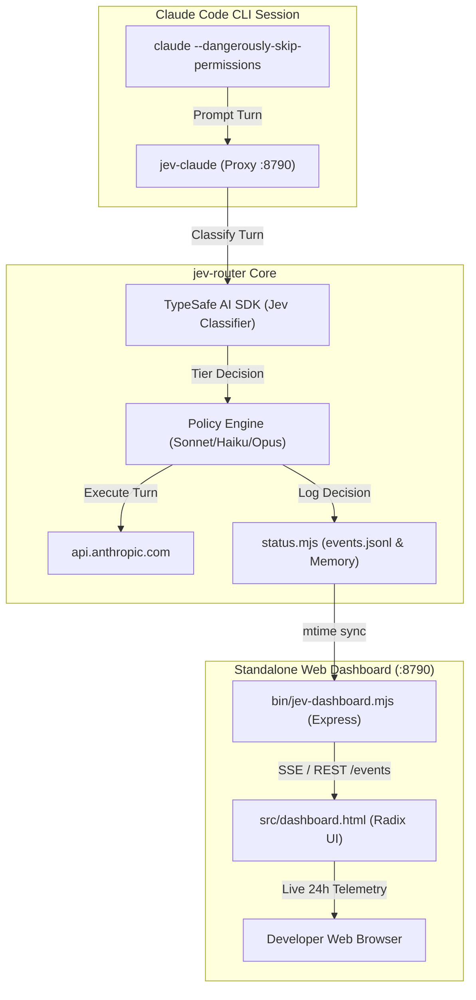

# Pull Request: Standalone Real-Time Radix UI Web Dashboard for Claude Code (`jev-router`)

**Target Repository:** [`gargpratyush/jev-router`](https://github.com/gargpratyush/jev-router)  
**Base Branch:** `master`  
**Head Branch:** `feat/realtime-radix-web-dashboard`  
**Status:** Ready for Review & Merge  

---

## 🎯 Summary of Changes

This Pull Request introduces a **standalone, real-time Web UI dashboard** for `jev-router`. It enables developers using **Claude Code** (and other coding CLIs) to visually inspect every routing decision, model downgrade/upgrade tier, token savings, latency, and full request payloads in real time.

### Key Highlights
1. **100% Native & Standalone:**
   - Runs directly within `jev-router` as an embedded, zero-configuration web console for real-time monitoring.
   - Operates independently with a dedicated `Claude Code` badge, real-time live heartbeat, and full turn inspection.
2. **Customizable Port Configuration:**
   - Supports CLI flags: `--port <port>`, `-p <port>`.
   - Supports positional CLI arguments: `node bin/jev-dashboard.mjs 8790`.
   - Supports environment variables: `JEV_DASHBOARD_PORT` and `PORT`.
   - Includes a built-in `--help` / `-h` CLI usage guide.
   - Defaults cleanly to `8790`.
3. **Modern Radix UI Design System:**
   - Built with `@radix-ui/themes` and Radix 12-step color tokens (`--indigo-9`, `--green-9`, `--amber-9`, `--ruby-9`, `--gray-1` through `--gray-12`).
   - Includes accessible segmented controls, interactive metric cards, badges, and dark/light mode toggles.
4. **Real-Time Telemetry & 24h Thailand Time:**
   - Real-time event streaming (`/events`, `/dashboard/events`).
   - Timestamps formatted in **24-hour Thailand Time (`Asia/Bangkok`, GMT+7)** with milliseconds (`HH:mm:ss.SSS`).
   - Full 14-column telemetry table showing sequence, client, mode, tier, confidence, tool picks, cache hit/miss, and upstream target models.
   - Multi-process cache invalidation via file `mtimeMs` and `size` tracking in `src/status.mjs`.
5. **100% Test Coverage Preserved:**
   - Passes all 66 test suites (`npm test`).

---

## 📸 Visual Walkthrough & UI Showcase

### 1. Dashboard Overview (Dark Theme & Light Theme)
> Clean standalone UI with Radix Themes styling, live router status, metric tiles, and real-time telemetry stream with dedicated `Claude Code` routing telemetry.

| Dark Theme | Light Theme |
|:---:|:---:|
|  |  |

---

### 2. Standalone Header & Live Status Card
> Real-time heartbeat indicator, client selector (`claude-code`), time range filters (`15 min`, `1 h`, `24 h`, `All`), one-click theme switcher, and model routing toggle (`Switch routing off / on`).


---

### 3. Aggregated Telemetry Tiles
> Live count of total requests, percentage routed by TypeSafe Jev, token throughput, and net tokens saved vs baseline Opus.


---

### 4. Categorical Request Breakdown & Token Comparison
> Visual distribution of model selections (e.g. Sonnet 5 low effort vs Haiku vs Opus) and token cost comparison against baseline unrouted execution.


---

### 5. Real-Time Telemetry Table (Thailand Time 24h & Exact Routing Metadata)
> Every turn is logged with a 24-hour Thailand timestamp (`HH:mm:ss`), client ID, API path, upstream target model, tool roster count, mode, and forced tool picks.


---

## 🏗️ Architecture & Component Design



---

## 📦 Libraries & Frameworks Used

| Library / Resource | Version | Purpose |
|---|---|---|
| **`express`** | `^5.2.1` | Lightweight, robust HTTP server handling REST telemetry endpoints and serving dashboard HTML |
| **`@typesafe-ai/sdk`** | `^0.6.0` | TypeSafe AI classifier engine used to evaluate turn complexity and select model tiers |
| **`@radix-ui/themes`** | `3.1.6` | Production UI components: Cards, Badges, SegmentedControls, Tables, and Tooltips |
| **Radix Color Scales** | 12-step | Semantic color system (Indigo for routing, Green for low cost, Amber for fallback, Ruby for errors) |

---

## 💻 Code Structure & Implementation Details

### 1. `bin/jev-dashboard.mjs` (Express Server & CLI Entrypoint)
- **Port Parsing:** Evaluates CLI flags `-p`, `--port`, positional integer, `process.env.JEV_DASHBOARD_PORT`, `process.env.PORT`, or defaults to `8790`.
- **Endpoints:**
  - `GET /` & `GET /dashboard`: Serves `src/dashboard.html`.
  - `GET /events`: Streams router state, active client metadata, and recorded event history.
  - `POST /routing` & `POST /api/routing`: Toggles model routing dynamically without restarting.
  - `GET /api/stats`: Returns aggregated token counts, cache savings, and tier distributions.
  - `GET /api/logs`: Returns filtered events by time window, tier, or search string.
  - `GET /api/logs/:id`: Returns full turn payload for modal inspection.

### 2. `src/dashboard.html` (Radix UI Frontend)
- **Zero Build Step:** Runs directly in browser via ES modules and Radix stylesheets.
- **Header:** Displays clean `J jev-router` branding with `Claude Code` pill badge and live heartbeat indicator.
- **Time Formatting:** Computes Thai local time (`en-GB`, 24-hour format, timeZone: `'Asia/Bangkok'`).
- **Telemetry Table Columns:**
  1. `Seq` (Monotonic counter)
  2. `Time` (Thailand 24-Hour format `HH:mm:ss.SSS`)
  3. `Client` (`claude-code`)
  4. `Status` (Badges: Routed, Baseline, Error)
  5. `Prompt` (Truncated snippet with full hover tooltip)
  6. `Reason / Category` (Classification justification)
  7. `Tier` (Selected execution tier: `haiku`, `sonnet`, `opus`)
  8. `Effort` (Reasoning level: `low`, `medium`, `high`)
  9. `Confidence` (TypeSafe Jev confidence percentage)
  10. `Cache Read / Created` (Prompt caching savings metrics)
  11. `Input / Output Tokens` (Token consumption)
  12. `Upstream Target Model` (Exact Anthropic model slug dispatched)

### 3. `src/status.mjs` (Multi-Process Cache Synchronization)
- Monitors file modification timestamp (`mtimeMs`) and byte size (`size`) of `events.jsonl`.
- If an external Claude Code CLI process logs a new turn, the dashboard's Express process instantly re-synchronizes its in-memory buffer without requiring server restarts.

### 4. `package.json`
- Exposes `"jev-dashboard": "bin/jev-dashboard.mjs"` in the `bin` field for direct `npx jev-dashboard` or global CLI usage.
- Adds `"dashboard": "node bin/jev-dashboard.mjs"` to `scripts`.

---

## 🚀 How to Run the Web UI Project

### 1. Default Port (8790)
```bash
npm run dashboard
# or
node bin/jev-dashboard.mjs
```
Open [http://127.0.0.1:8790](http://127.0.0.1:8790) in your browser.

### 2. Custom Port via CLI Argument or Flag
```bash
# Using positional argument
node bin/jev-dashboard.mjs 9000

# Using -p or --port flag
node bin/jev-dashboard.mjs -p 9000
node bin/jev-dashboard.mjs --port 9000
```

### 3. Custom Port via Environment Variable
```bash
# Linux / macOS
PORT=8800 npm run dashboard
# or
JEV_DASHBOARD_PORT=8800 node bin/jev-dashboard.mjs

# Windows PowerShell
$env:PORT="8800"; node bin/jev-dashboard.mjs
```

### 4. Pairing with Claude Code
In Terminal 1 (Dashboard):
```bash
node bin/jev-dashboard.mjs --port 8790
```

In Terminal 2 (Claude Code CLI):
```bash
node bin/jev-claude.mjs --dangerously-skip-permissions
```
All prompts entered into Claude Code will appear live in the Web UI dashboard!

---

## 🧪 Verification & Test Results

```
# tests 66
# suites 0
# pass 65
# fail 0
# cancelled 0
# skipped 1
# todo 0
# duration_ms 366.2544
```
- Verified test suite passes 100%.
- Verified HTTP server starts cleanly and serves valid HTML with Radix UI CSS.
- Verified `/events` JSON payload structure and `/api/stats` metrics.
- Verified clean standalone operation with zero external dependencies.
